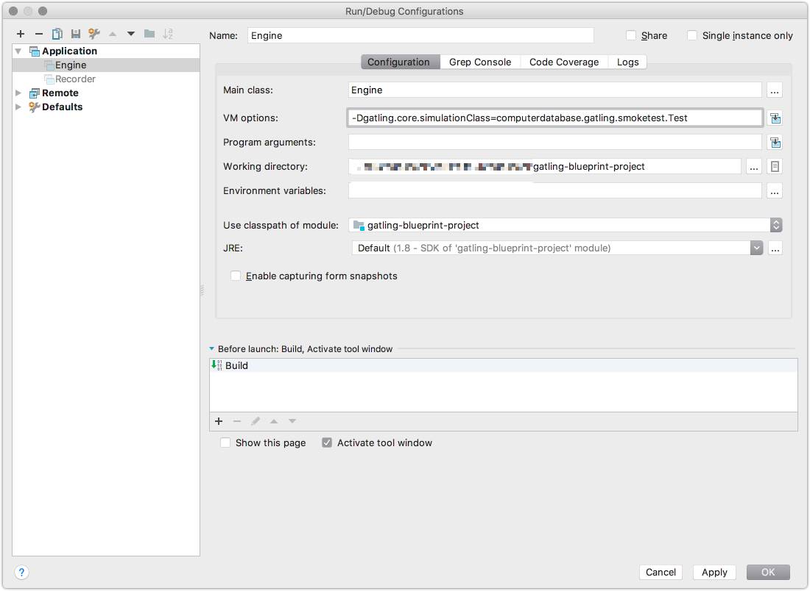
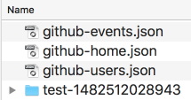

# Gatling Blueprint Project

Thanks to Travis for the [build status](https://travis-ci.org/sgoeschl/gatling-blueprint-project): 
[](https://travis-ci.org/sgoeschl/gatling-blueprint-project)

## 1. Overview

* Provide out-of-the-box IDE support for writing & debugging Gatling script 
* Run multi-tenant & multi-site Gatling tests from IDE, Apache Maven and shell script
* Create a stand-alone Gatling distribution requiring only Java 1.8 and optionally Apache Ant 1.9.x 
* Implement pretty-printing and custom filtering of JSON responses

### 1.1 Words Of Caution

* Please note that this project depends on [sgoeschl/gatling-blueprint-extensions](https://github.com/sgoeschl/gatling-blueprint-extensions) 

## 2. Motivation

During my work at [Erste Group](https://www.erstegroup.com) I came across interesting test scenarios such as

* End-to-End performance testing spanning multiple REST APIs
* Support of multiple tenants with different test scripts and test data
* Support of multiple test environments such as DEV, FAT, UAT & PROD with different configuration data
* Some functional testing flavor comparing current with expected JSON responses
* Smoke tests after a deployment using existing performance tests

In case you are still interested here are list of links with background information

* [http://people.apache.org/~sgoeschl/presentations/2016/testworks/gatling.pdf](http://people.apache.org/~sgoeschl/presentations/2016/testworks/gatling.pdf)
* [https://huddle.eurostarsoftwaretesting.com/gatling-tales-from-a-journey/](https://huddle.eurostarsoftwaretesting.com/gatling-tales-from-a-journey/)

## 3. Scope

* Since my Scala skill are rudimentary at best I moved support code into a [seperate Java project](https://github.com/sgoeschl/gatling-blueprint-extensions)
* There is no single Gatling setup to rule them all (at least I'm not able to provide one) but this project can help with some commonly used functionality
* It is assumed that you will challenge and/or change some/many of my design decision and you are free to do so - hence it is called blueprint. Having said that constructive feedback is highly appreciated and will improve my pet project in the long run.

## 4. The Mental Domain Model

* We define four configuration dimensions
    * `tenant`
    * `application`
    * `site`
    * `scope`
* The dimension `tenant`, `application` and `scope` map to `application.tenant.scope.Test` which is the Gatling script to be executed
* The dimension `site` is passed as system property and is used to pick up the correct configuration information from `./user-files/data`
* It is assumed that testing with different `site` parameter does not require different Gatling tests
* The configuration information is stored in `environment.properties` files in a hierarchical directory layout
* Other configuration files, e.g. CSV files, can be picked from a hierarchical directory layout

## 5. Code Samples

In order to make things understandable there are two sample project provided - both are a bit artificial but demonstrate many key points

### 5.1 Original Computer Database

This is a 1:1 copy of the original sample

#### Running Tests From The IDE

Invoking the `Engine` class within the IDE with one of the following system properties

* -Dgatling.core.simulationClass=computerdatabase.BasicSimulation
* -Dgatling.core.simulationClass=computerdatabase.advanced.AdvancedSimulationStep01
* -Dgatling.core.simulationClass=computerdatabase.advanced.AdvancedSimulationStep02
* -Dgatling.core.simulationClass=computerdatabase.advanced.AdvancedSimulationStep03
* -Dgatling.core.simulationClass=computerdatabase.advanced.AdvancedSimulationStep04
* -Dgatling.core.simulationClass=computerdatabase.advanced.AdvancedSimulationStep05

#### Running Tests From The Maven Command Line

Fist we start the smoke test using

> mvn -Dgatling.simulationClass=computerdatabase.advanced.AdvancedSimulationStep01 gatling:test
> mvn -Dgatling.simulationClass=computerdatabase.advanced.AdvancedSimulationStep02 gatling:test
> mvn -Dgatling.simulationClass=computerdatabase.advanced.AdvancedSimulationStep03 gatling:test
> mvn -Dgatling.simulationClass=computerdatabase.advanced.AdvancedSimulationStep04 gatling:test
> mvn -Dgatling.simulationClass=computerdatabase.advanced.AdvancedSimulationStep05 gatling:test

### 5.2 Gatling Computer Database

The Gatling working horse modified to work seamlessly with the `Gatling Blueprint Project`

* Assuming the following coordinates `computerdatabase-gatling-${scope}-local`
    * The tests are targeting the application `computerdatabase`
    * Since this application is hosted by the Gatling cooperation the tenant is `gatling`
    * There are two provided scopes - `smoketest` and `functional`
    * We also assume that the site is called `local` (to be on the save side)
* Those two test map into `computerdatabase.gatling.functional.Test` and `computerdatabase.gatling.smoketest.Test`
* Each test scenario has its own `search.csv`
* Each test scenario runs different test as defined in `ComputerDatabaseChainBuilder`
* Each test scenario runs different user scenario derived from `environment.properties`

#### Running Tests From The IDE

Invoking the `Engine` class within the IDE with one of the following system properties

* -Dgatling.core.simulationClass=computerdatabase.gatling.smoketest.Test
* -Dgatling.core.simulationClass=computerdatabase.gatling.functional.Test

A sample screenshot from the IntelliJ Community Edition



#### Running Tests From The Maven Command Line

Fist we start the smoke test using

> mvn -Dgatling.simulationClass=computerdatabase.gatling.smoketest.Test gatling:test

```
Coordinates: {application='computerdatabase', tenant='gatling', site='local', scope='smoketest'}
Environment: {simulation.pause.ms=100, computerdatabase.base.url=http://computer-database.gatling.io}
Simulation: (usersAtOnce=1, users=1, usersRampup=0 seconds, duration=300 seconds, loops=1, tryMax=1, pause=100 milliseconds)
Data Directory: /Users/sgoeschl/work/github/sgoeschl/gatling-blueprint-project/user-files/data
Result Directory: /Users/sgoeschl/work/github/sgoeschl/gatling-blueprint-project/target/gatling
Resolve file 'search.csv' to 'gatling/local/computerdatabase/smoketest/search.csv'

================================================================================
2017-11-28 15:09:37                                           1s elapsed
---- Requests ------------------------------------------------------------------
> Global                                                   (OK=10     KO=0     )
> Home                                                     (OK=2      KO=0     )
> Home Redirect 1                                          (OK=2      KO=0     )
> Search                                                   (OK=2      KO=0     )
> Select                                                   (OK=2      KO=0     )
> Page 0                                                   (OK=2      KO=0     )

---- computerdatabase-gatling-local-smoketest ----------------------------------
[##########################################################################]100%
          waiting: 0      / active: 0      / done:2     
================================================================================
```

Afterwards we run the functional test flavor using

> mvn -Dgatling.simulationClass=computerdatabase.gatling.functional.Test clean gatling:test

```
Coordinates: {application='computerdatabase', tenant='gatling', site='local', scope='functional'}
Environment: {simulation.pause.ms=1000, computerdatabase.base.url=http://computer-database.gatling.io}
Simulation: (usersAtOnce=1, users=1, usersRampup=0 seconds, duration=300 seconds, loops=1, tryMax=1, pause=1000 milliseconds)
Data Directory: /Users/sgoeschl/work/github/sgoeschl/gatling-blueprint-project/user-files/data
Result Directory: /Users/sgoeschl/work/github/sgoeschl/gatling-blueprint-project/target/gatling
Resolve file 'search.csv' to 'gatling/local/computerdatabase/search.csv'

================================================================================
2017-11-28 15:12:35                                          49s elapsed
---- Requests ------------------------------------------------------------------
> Global                                                   (OK=45     KO=0     )
> Home                                                     (OK=5      KO=0     )
> Home Redirect 1                                          (OK=5      KO=0     )
> Search                                                   (OK=5      KO=0     )
> Select                                                   (OK=5      KO=0     )
> Page 0                                                   (OK=5      KO=0     )
> Page 1                                                   (OK=5      KO=0     )
> Page 2                                                   (OK=5      KO=0     )
> Page 3                                                   (OK=5      KO=0     )
> Page 4                                                   (OK=5      KO=0     )

---- computerdatabase-gatling-local-functional ---------------------------------
[##########################################################################]100%
          waiting: 0      / active: 0      / done:5     
================================================================================
```

### 5.3 GitHub REST API

A REST API example showing JSON response handling

* Assuming the following coordinates `githubapi-github-functional-local`
* For a non-performance tests the JSON responses are pretty-printed and saved

```scala
object GitHubApi {

  val home: ChainBuilder = exec(http("Home")
    .get("/")
    .check(
      jsonPath("$").ofType[Any].find.saveAs("lastResponse")))
    .exec(session => {
      JsonResponseTool.saveToFile(session, "lastResponse", "githubapi", "home")
      session
    })
}    
```    

> mvn -Dgatling.simulationClass=githubapi.github.functional.Test clean gatling:test

```
Coordinates: {application='githubapi', tenant='github', site='local', scope='functional'}
Environment: {githubapi.base.url=https://api.github.com, simulation.pause.ms=1000}
Simulation: (usersAtOnce=1, users=1, usersRampup=0 seconds, duration=300 seconds, loops=1, tryMax=1, pause=1000 milliseconds)
Data Directory: /Users/sgoeschl/work/github/sgoeschl/gatling-blueprint-project/user-files/data
Result Directory: /Users/sgoeschl/work/github/sgoeschl/gatling-blueprint-project/target/gatling

================================================================================
2017-11-28 15:14:30                                           6s elapsed
---- Requests ------------------------------------------------------------------
> Global                                                   (OK=3      KO=0     )
> Home                                                     (OK=1      KO=0     )
> Users                                                    (OK=1      KO=0     )
> Events                                                   (OK=1      KO=0     )

---- githubapi-github-local-functional -----------------------------------------
[##########################################################################]100%
          waiting: 0      / active: 0      / done:1     
================================================================================
```

After the test run you will see the following directory content



## 6. Testing Elastic Server

[Erste Group](https://www.erstegroup.com) is also using Elastic heavily so over the years I implemented some bits & pices to make that testing Elastic more straight-forward

* The [elastic-slow-query-log-parser](https://github.com/sgoeschl/elastic-slow-query-log-parser) is a blue-print to convert an Elastic slow query log into a TSV file to be used with JMeter or Gatling
* The TSV file is placed under `./user-files/data/elasticapi/local/elastic` or `./user-files/data/elasticapi/local/elastic/${scope}`

You can start the pre-defined scenarios using Maven

>  mvn -Dgatling.simulationClass=elasticapi.elastic.smoketest.Test -Dsite=local clean gatling:test 
>  mvn -Dgatling.simulationClass=elasticapi.elastic.functional.Test -Dsite=local clean gatling:test 
>  mvn -Dgatling.simulationClass=elasticapi.elastic.performance.Test -Dsite=local clean gatling:test 

or run the `Ant Standalone Distribution` using


```text
> mvn -Pstandalone clean package
> cd ./target/distributable/gatling-charts-highcharts-bundle-2.3.1/
> ant -Dapplication=elasticapi -Dtenant=elastic -Dscope=smoketest -Dsite=local clean info test
```

As usual you need the configuration of the performance test found in `environment.properties`, e.g.

```text
simulation.users=10
simulation.users.rampup=10
simulation.duration=600
```

would fire up 10 virtual users within 10 seconds and run as fast as possible for 600 seconds

## 7. Tips And Tricks

### 7.1 Debugging Gatling Scripts From The IDE

* You can debug your Gatling scenario using `Engine` with the VM options `-Dgatling.core.simulationClass=computerdatabase.BasicSimulation`
* You can change the `logback` configuration using the `-Dlogback.configurationFile` system property

### 7.2 Running Gatling With Maven

Using the Maven integration is the preferred way when you run Gatling tests from a CI server such as Jenkins

```text
mvn -Dgatling.simulationClass=computerdatabase.gatling.smoketest.Test clean gatling:test
mvn -Dgatling.simulationClass=computerdatabase.gatling.functional.Test clean gatling:test
mvn -Dlogback.configurationFile=conf/logback-debug.xml -Dgatling.simulationClass=computerdatabase.gatling.functional.Test clean gatling:test
```

There are a couple of system parameters allowing to overwrite the [Gatling 2.2.4 Maven plugin configuration](https://github.com/gatling/gatling-maven-plugin/blob/master/src/main/java/io/gatling/mojo/GatlingMojo.java)

| Property                            | Description                                                                                                 |
|-------------------------------------|-------------------------------------------------------------------------------------------------------------|
| gatling.noReports                   | Run simulation but does not generate reports. By default false.                                             |
| gatling.reportsOnly                 | Generate the reports for the simulation in this folder.                                                     |
| gatling.simulationsFolder           | Use this folder to discover simulations that could be run.                                                  |
| gatling.simulationClass             | A name of a Simulation class to run.                                                                        |
| gatling.dataFolder                  | Use this folder as the folder where feeders are stored.                                                     |
| gatling.resultsFolder               | Use this folder as the folder where results are stored.                                                     |
| gatling.jvmArgs                     | Extra JVM arguments to pass when running Gatling.                                                           |
| gatling.zincJvmArgs                 | Extra JVM arguments to pass when running Zinc.                                                              |
| gatling.failOnError                 | Will cause the project build to look successful, rather than fail, even if there are Gatling test failures. |
| gatling.continueOnAssertionFailure  | Continue execution of simulations despite assertion failure.                                                |
| gatling.outputName                  | Force the name of the directory generated for the results of the run.                                       |
| gatling.propagateSystemProperties   | Propagate System properties to forked processes.                                                            |
| gatling.skip                        | Disable the plugin.                                                                                         |
| gatling.disableCompiler             | Disable the Scala compiler, if scala-maven-plugin is already in charge of compiling the simulations.        |
| gatling.includes                    | List of list of include patterns to use for scanning.                                                       |
| gatling.excludes                    | List of list of exclude patterns to use for scanning.                                                       |
| gatling.runDescription              | A short description of the run to include in the report.                                                    |

### 7.3 Running the Standalone Gatling Distribution Using Shell Scripts

On Linux/Unix you can easily execute tests with the existing shell scripts

```text
./bin/gatling.sh -s computerdatabase.gatling.smoketest.Test
./bin/gatling.sh --simulation computerdatabase.gatling.smoketest.Test
```

Please note that doing that on Windows has issues - you start a batch file which starts a Java process. But when you terminate the test run using `CTRL-C` you are actually killing the Windows Command Processor but the JVM - Windows does not terminate child processed.

### 7.4 Running the Standalone Gatling Distribution Using Apache Ant

The Ant integration is used to more easily distribute Gatling test only requiring JDK 1.8 and Ant installation in secure environments. Before you can use the Ant integration you need to create the stand-alone distribution as shown below

```text
mvn -Pstandalone clean install
cd target/distributable/gatling-charts-highcharts-bundle-2.3.1/
```

You can hava a look at all available Ant targets

```text
> ant -p

Main targets:

 archive        Archives the output of the executed test
 archive:clean  Delete all archived test reports
 clean          Clean the working directory for the current test scenario
 clean:all      Clean the working directory for all tests
 copy-report    Copy the Gatling report to another directory
 diff           Compare expected with current responses
 diff:visual    Compare expected with current responses using a visual diff tool
 fail-on-error  Force a build error if the Gatling test has failed before
 info           Print the current configuration
 record         Run the functional test and capture expected responses
 reset          Remove expected JSON responses for all tests
 run            Run the functional test but ignore failures
 save           Save the current output as new expected responses
 test           Run the functional test and fail on error
 verify         Run the tests and and compare with expected responses
Default target: info
```

And print the current configuration

```text
> ant info
> ant -Dapplication=computerdatabase -Dtenant=gatling -Dscope=smoketest clean info test
> ant -Dapplication=computerdatabase -Dtenant=gatling -Dscope=functional clean info test
> ant -Dapplication=githubapi -Dtenant=github -Dscope=functional clean info test
> ant -Dapplication=githubapi -Dtenant=github -Dscope=functional clean info record
> ant -Dapplication=githubapi -Dtenant=github -Dscope=functional clean info verify
```

In case of a failed Gatling tests the Ant script just stops- sometimes it is useful to fail later, e.g.

```text
> ant -Dapplication=computerdatabase -Dscope=smoketest info run archive copy-report fail-on-error

archive:
      [zip] Building zip: user-files/archive/computerdatabase-tenant-local-smoketest-20170330T224945.zip

copy-report:

gatling:copy-report:
     [copy] Copying 42 files to results/computerdatabase/tenant/local/smoketest/report

fail-on-error:

gatling:fail-on-error:

BUILD SUCCESSFUL
```

This Ant invocation

* Runs a Gatling tests
* Copy the Gatling report to an additional directory, e.g. to serve it from an web server
* Archive the Gatling report as ZIP file

## 8. Additional Information

### 8.1 More Online Resources

A must-read for all Scala/Gatling starters is stuff on [http://automationrhapsody.com/performance-testing-with-gatling](http://automationrhapsody.com/performance-testing-with-gatling)

### 8.2 Gatling Blueprint Configuration Properties

Commonly used configuration settings found in `environment.properties`

| Property                  | Description                                                 |
|---------------------------|-------------------------------------------------------------|
| simulation.duration       | Duration of the simulation in seconds                       |
| simulation.pause.ms       | Milliseconds to pause                                       |
| simulation.try.max        | Number of retries before reporting an error                 |
| simulation.users          | Number of users of virtual users                            |
| simulation.users.atonce   | Number of users to start at once                            |
| simulation.users.rampup   | Rampup time in seconds                                      |
| simulation.loops          | Number of loops                                             |

Please note that not all of the properties might have an effect on your current simulation (the need to used by the code).
